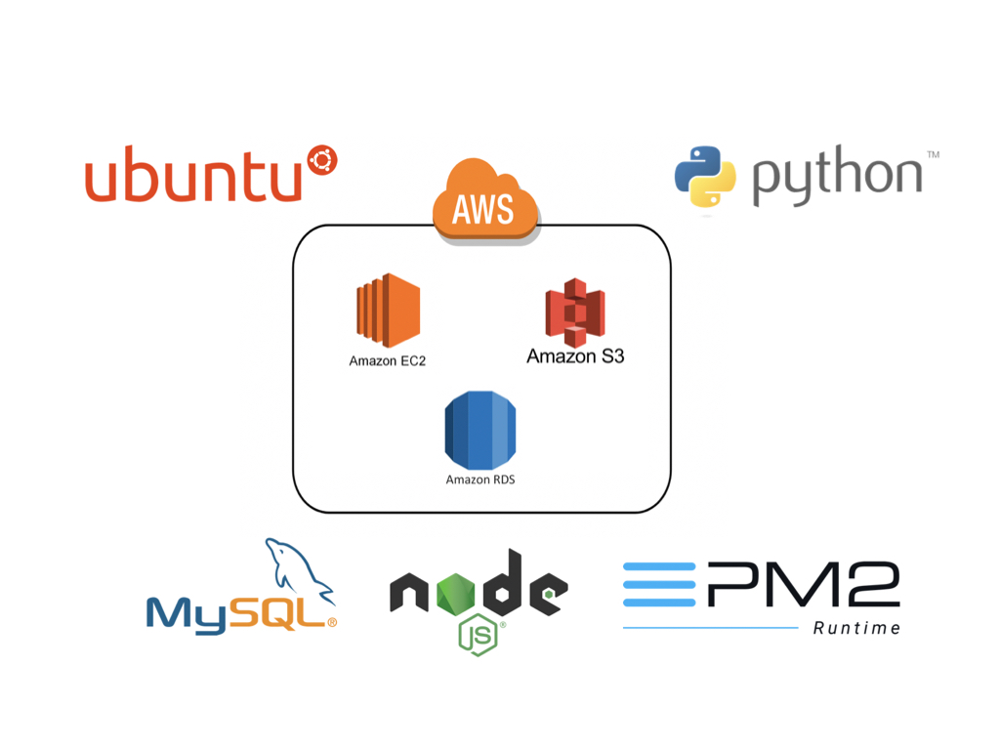

# TokDDak-Server

*
---

# 주요 기능

* 회원가입 / 로그인 
* 카테고리별 지출내역 작성 및 관리  
* 

---


# 폴더 구조

#### 서버

* /City, /Activity, /Food, /Hotel, /Shopping, /Snack, /Transport, /User


# Server Architecture  



### Auth
* 인증 서버
  * JWT를 이용하여 사용자에게 토큰을 발급하여 통신시 사용자를 인증하는 용도로 쓰인다
  * REDIS에 사용자의 토큰과 접속 시간을 저장하여 연속 접속 인수를 계산한다.
  * 의존성
  ```json
  "dependencies": {
    "cookie-parser": "~1.4.3",
    "debug": "~2.6.9",
    "ejs": "^2.6.1",
    "express": "~4.16.0",
    "express-session": "^1.15.6",
    "helmet": "^3.15.0",
    "http-errors": "~1.6.2",
    "jade": "~1.11.0",
    "jsonwebtoken": "^8.4.0",
    "moment": "^2.24.0",
    "morgan": "~1.9.0",
    "passport": "^0.4.0",
    "passport-kakao": "0.0.5",
    "passport-local": "^1.0.0",
    "passport-naver": "^1.0.6",
    "promise-mysql": "^3.3.1",
    "rand-token": "^0.4.0",
    "redis": "^2.8.0",
    "request": "^2.88.0",
    "request-promise": "^4.2.4"
  }```
  ```

### PMS
* 정치인 관리 서버
  * 의존성
  ```json
  "dependencies": {
    "axios": "^0.18.0",
    "connect-history-api-fallback": "^1.6.0",
    "cookie-parser": "^1.4.3",
    "debug": "~2.6.9",
    "express": "^4.16.4",
    "express-csp-header": "^2.2.0",
    "express-paginate": "^1.0.0",
    "fs": "0.0.1-security",
    "http-errors": "^1.6.3",
    "jade": "~1.11.0",
    "moment": "^2.24.0",
    "morgan": "^1.9.1",
    "mysql": "^2.16.0",
    "mz": "^2.7.0",
    "path": "^0.12.7",
    "promise-mysql": "^3.3.1",
    "pug": "^2.0.3",
    "redis": "^2.8.0",
    "request": "^2.88.0",
    "sync-request": "^6.0.0",
    "xml2json": "^0.11.2"
  }``` 
  ```

### CMS
* 컨텐츠 관리 서버
  * 기사 크롤링
    * 파이썬을 이용하여 기사를 크롤링하고 스케줄러를 통해 5분마다 기사를 트롤링해온다
  * 댓글 관리
  * 의존성
  ```json
  "dependencies": {
    "cookie-parser": "~1.4.3",
    "debug": "~2.6.9",
    "express": "~4.16.0",
    "fs": "0.0.1-security",
    "http-errors": "~1.6.2",
    "jade": "~1.11.0",
    "moment": "^2.24.0",
    "morgan": "~1.9.0",
    "node-cron": "^2.0.3",
    "nodemon": "^1.18.10",
    "promise-mysql": "^3.3.1",
    "redis": "^2.8.0"
  }```
  ```


### Vote
* 투표 관리 서비스
  * 매번 메인 뷰인 전체 투표리스트를 할 때 마다 DB 셀렉을 해올 수 없기 때문에(불필요한 통신) 5분마다 투표 결과를 빌드해놓고 그 결과를 보여준다.
  * 의존성
  ```json
  "dependencies": {
  "async": "^2.6.1",
  "aws-sdk": "^2.269.1",
  "cookie-parser": "^1.4.3",
  "debug": "^2.6.9",
  "express": "^4.16.3",
  "helmet": "^3.12.1",
  "http-errors": "^1.6.3",
  "jade": "^1.11.0",
  "jsonwebtoken": "^8.3.0",
  "moment": "^2.22.2",
  "morgan": "^1.9.0",
  "multer": "^1.3.1",
  "multer-s3": "^2.7.0",
  "promise-mysql": "^3.3.1"
  }}``` 
  ```


---

# Develop Framework & Environment

[Node.js](https://nodejs.org/ko/) - Chrome V8 자바스크립트 엔진으로 빌드된 자바스크립트 런타임
- [Express.js](http://expressjs.com/ko/) - Node.js 웹 애플리케이션 프레임워크
- [NPM](https://rometools.github.io/rome/) - 자바 스크립트 패키지 관리자
- [PM2](http://pm2.keymetrics.io/) - Express 앱용 프로세스 관리자
- [vscode](https://code.visualstudio.com/) - 편집기
- [Mysql](https://www.mysql.com/) - DataBase
- [AWS EC2](https://aws.amazon.com/ko/ec2/?sc_channel=PS&sc_campaign=acquisition_KR&sc_publisher=google&sc_medium=english_ec2_b&sc_content=ec2_e&sc_detail=aws%20ec2&sc_category=ec2&sc_segment=177228231544&sc_matchtype=e&sc_country=KR&s_kwcid=AL!4422!3!177228231544!e!!g!!aws%20ec2&ef_id=WkRozwAAAnO-lPWy:20180412120123:s) - 클라우드 환경 컴퓨팅 시스템
- [AWS RDS](https://aws.amazon.com/ko/rds/) - 클라우드 환경 데이터베이스 관리 시스템
- [Python 3](https://www.python.org/)
- [PyCharm](https://www.jetbrains.com/pycharm/download/#section=mac) - 편집기


* MYSQL v5.7 (Workbench)
* Sequal Pro

---


# 사용 Module

* [Async & Await](https://www.npmjs.com/package/async)

* [JWT(JsonWebTokens)](https://www.npmjs.com/package/jsonwebtoken)

* [request(HTTP)](https://www.npmjs.com/package/request)

* [multer](https://www.npmjs.com/package/multer)

* [crypto](https://www.npmjs.com/package/create-hash)


---

# 개발자
* 현주희 ([Hyun-juhee](https://github.com/Hyun-juhee))

